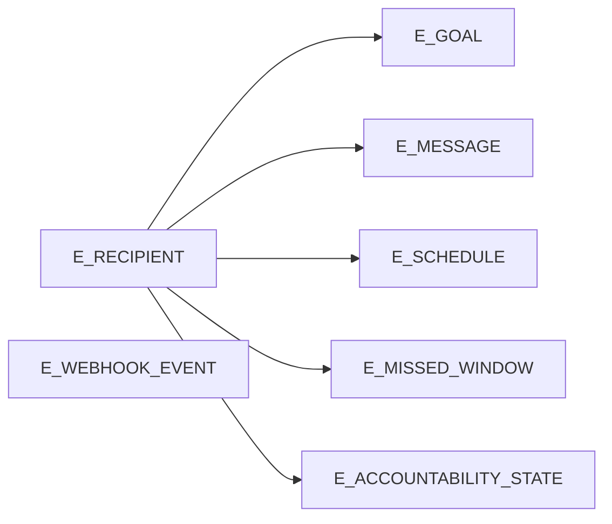

# Data Model and Ownership Design Document (MVP Backend)

**Clerk is not used** for MVP (ADR + SPC-001)—identity and account data **authoritatively live in Supabase Postgres**.

---

## 1. Document Purpose

- **What this is for:** A single reference for **logical MVP entities**, **relationships and cardinality**, **practical integrity rules**, and **where each datum is authoritative vs derived**—so repositories, adapters, and reviews stay aligned with [docs/adr-001-backend-mvp-architecture.md](adr-001-backend-mvp-architecture.md) and [docs/implementation-constraints.md](implementation-constraints.md).
- **How to use it during implementation:** When adding persistence or cross-module flows, declare **one write path per business datum** (DDC-001), **recipient scoping in application code** (DDC-003), and **storage purpose** (Postgres vs S3 vs Redis job payload) before coding schema or repositories. Use it alongside [docs/contracts-first-mvp-backend.md](contracts-first-mvp-backend.md) for boundaries—not as a substitute for API/job payload schemas.

---

## 2. Source-of-Truth Order

**Governing docs (highest first):**

1. [docs/adr-001-backend-mvp-architecture.md](adr-001-backend-mvp-architecture.md)
2. [docs/implementation-constraints.md](implementation-constraints.md)
3. [docs/backend-folder-structure-design.md](backend-folder-structure-design.md)
4. [docs/contracts-first-mvp-backend.md](contracts-first-mvp-backend.md)
5. [docs/PRD.md](PRD.md)
6. [docs/clarification-answers.md](clarification-answers.md)
7. [docs/resolved-architecture-intake.md](resolved-architecture-intake.md)

**Conflict resolution:** Higher row wins. Example: **no third-party end-user auth** and **LoopMessage recipient as canonical identity** override any legacy PRD wording; [docs/resolved-architecture-intake.md](resolved-architecture-intake.md) **§17** (web-only OTP verification for MVP) wins over older optional iMessage OTP verification phrasing.

---

## 3. Data Modeling Principles

- **MVP scope:** Model only what **iMessage (LoopMessage) + utility web + single worker** need: conversation, goals, scheduling, accountability outcomes, rights (export/delete), webhook dedupe, metering, proactive policy inputs, abandonment/purge—not admin consoles, analytics pipelines, or extra channels.
- **Authoritative owner / system of record:** **Supabase Postgres** holds durable user and operational state the product must query and retain per policy. **Each business datum has one authoritative write path** (DDC-001); cross-cutting updates go through the owning module’s application surface (see [docs/backend-folder-structure-design.md](backend-folder-structure-design.md) §6).
- **Derived vs authoritative:** **Derived** includes: BullMQ job payloads and completion metadata used for orchestration; **recomputed** “next run” (or equivalent) from schedule inputs; **in-process caches** of DB-backed toggles (env overrides authoritative for those flags per ADR §8); **presigned URLs** (derived from S3 + policy); **LLM outputs** persisted only where product requires accountability/export—not a second “truth” for schedule rules.
- **Logical vs physical:** This document names **logical entities and attributes at summary level**; physical tables, JSON columns, and normalization choices are implementation decisions (no SQL/ORM here).

---

## 4. Entity Catalog

| Entity ID | Business meaning | Owning module / context | Key attributes (summary) | Identity / key | Lifecycle / state | Major relationships | Status |
| --- | --- | --- | --- | --- | --- | --- | --- |
| **E-RECIPIENT** | App’s view of a LoopMessage user (known contact). | **identity-recipient** owns primary recipient persistence; other modules update recipient-related fields via exported services. | LoopMessage recipient identifier (E.164 and/or email per provider); first-inbound / known-contact flags; quiet-hours timezone; global pause; onboarding-complete when first goal exists (per Q3.R2). | Stable **internal recipient id** + unique **LoopMessage recipient** string. | Created on first qualifying inbound; updated through conversation and maintenance jobs; **deleted** by account deletion job. | 1:1 active **E-GOAL** (MVP); 1:N **E-MESSAGE**; 1:1 schedule aggregate **E-SCHEDULE**; 1:N **E-USAGE-COUNTER** rows or fields. | **Approved** |
| **E-GOAL** | The single active goal for a user (MVP). | **goal-scheduling** | Goal text/config; per-goal pause/snooze; linkage to recipient. | Unique per recipient for “active” invariant (at most one active). | **Append-only lifecycle:** goal changes create a new row and mark prior goal inactive/superseded; removed on account delete. | N:1 **E-RECIPIENT**; drives **E-SCHEDULE** inputs. | **Approved** |
| **E-MESSAGE** | Inbound/outbound message record for accountability and export. | **conversation-accountability** (content + NLU/accountability); **outbound-messaging** may contribute outbound rows via orchestration). | Direction; text body; timestamps; provider references as needed for send idempotency correlation; **inbound images: no S3 bytes, but minimal metadata may be stored** (for example `has_image_attachment`, optional provider attachment ref). | Unique message id per recipient (implementation may use provider ids where stable). | Retained until account deletion (Q6.1). Export is generated from stored message rows. | N:1 **E-RECIPIENT**; optional link to **E-NLU-OUTCOME** / accountability fields. | **Approved** |
| **E-NLU-OUTCOME** | Structured accountability/NLU facts from the primary LLM path. | **conversation-accountability** | Outcome type/role, structured classification (for example done/not-done), confidence optional, tie to turn/message. | Per outcome id, linked to message/turn. | Immutable fact after write; affects streak logic. | N:1 **E-RECIPIENT**; **N:1 E-MESSAGE** (multiple outcomes per message allowed). | **Approved** |
| **E-ACCOUNTABILITY-STATE** | Rolling streak / accountability aggregates consistent with missed windows. | **conversation-accountability** | Streak counters, last affirmative reference, policy inputs. | Per recipient in the **active goal context**. | Updated on interpreted outcomes and when marking missed windows; start fresh when goal is superseded. | 1:1 active goal context per recipient. | **Approved** |
| **E-SCHEDULE** | Persisted schedule **inputs** and **derived next-run** for check-ins. | **goal-scheduling** | Timezone; quiet hours; cadence/recurrence as modeled for MVP; **derived** next execution instant; pause/snooze interaction with goal. | One active schedule aggregate per recipient (tied to active goal lifecycle). | Recomputed in **one code path** on edits (ADR §4). | 1:1 **E-RECIPIENT** / active **E-GOAL**. | **Approved** |
| **E-MISSED-WINDOW** | A check-in window that was due but not processed in time. | **goal-scheduling** | Window identifier; due time; marked missed reason/time. | Unique per recipient + logical window slot. | Appended when downtime/slip detected; not rewritten as “sent.” | N:1 **E-RECIPIENT**; informs **E-ACCOUNTABILITY-STATE**. | **Approved** |
| **E-WEBHOOK-EVENT** | Durable idempotency record for inbound provider events. | **webhook-ingestion** | Provider event id; minimal metadata for dedupe and audit; **no** raw body storage requirement in domain (avoid logging full bodies per OAC-002). | **Unique provider event id** (field path per LoopMessage adapter note). | Insert-once semantics; immutable. | Optional link to internal processing ref. | **Approved** |
| **E-OTP-SESSION** | OTP issuance, attempts, and expiry for utility flows. | **otp-verification** | Recipient binding; hashed or encrypted code per security design; issued-at; expiry (~15m); send-rate tracking; failed attempt count. | Session / issuance id. | Active until verified, invalidated, or expired; **mark consumed on successful verify**; cleanup on account delete (Q10.R1). | N:1 **E-RECIPIENT** (only for **known** recipients). | **Approved** |
| **E-RIGHTS-SESSION** | Short-lived verified capability to request export/delete after OTP verify (opaque bearer binding). | **otp-verification** + **user-rights-ops** | Recipient scope; **combined capability flags** (`can_export`, `can_delete`); expiry. | Server-side session id (opaque token reference). | Short TTL; single-use policy is **not** required for download link (resolved §17); session still bounded. | N:1 **E-RECIPIENT**. | **Approved** |
| **E-EXPORT-JOB** | Export fulfillment tracking within SLA (3 US business days ET per ADR §14). | **user-rights-ops** | State machine: queued, building, delivered, failed; SLA deadline fields; correlation ids. | Unique job id. | Terminal states on success or exhausted failure/DLQ path; duplicate requests while in-flight are idempotent (reuse/return active job). | N:1 **E-RECIPIENT**; 1:1 **E-EXPORT-ARTIFACT** (when produced). | **Approved** |
| **E-EXPORT-ARTIFACT** | User export bundle **metadata**; bytes in S3. | **user-rights-ops** | S3 key, size, content hash optional; created-at; presigned TTL policy inputs. | Unique per bundle version per job. | One artifact per successful export job in MVP; deleted with account (Q10.R1) or lifecycle policy. | N:1 **E-RECIPIENT**; 1:1 **E-EXPORT-JOB**. | **Approved** |
| **E-DELETE-JOB** | Account deletion orchestration (async). | **user-rights-ops** | Phased deletion state; tombstone; pending job cancellation scope. | Unique job id. | Idempotent completion under retry; duplicate delete requests while in-flight are idempotent (same active job/no-op). | 1:1 **E-RECIPIENT** being deleted. | **Approved** |
| **E-USAGE-COUNTER** | Freemium usage counters for soft warnings (hard caps product-owned). | **usage-metering** | Counts for goals/check-ins as defined by product; threshold evaluation inputs. | Per recipient + metric type. | Reset/warn per policy; deleted on account deletion. | N:1 **E-RECIPIENT**. | **Approved** |
| **E-PROACTIVE-POLICY-STATE** | Inputs for caps and adaptive throttling (ADR §13). | **proactive-policy** | Rolling proactive send timestamps/counts; reply-rate window stats; backoff multipliers. | Per **E-RECIPIENT**. | Updated on sends/replies; respects quiet hours and pause. | N:1 **E-RECIPIENT**. | **Approved** (Postgres-only in MVP) |
| **E-OPERATIONAL-TOGGLE** | DB-backed feature flags with env hard-override (ADR §8). | **platform** config consumer; values are updated via ops/deploy paths only (no app API in MVP). | Flag key; boolean/value; optional cache hint. | Unique flag key. | Rare writes; read-heavy. | None user-facing. | **Approved** |
| **E-OUTBOUND-SEND-INTENT** | Idempotency and audit for externally visible sends (at-least-once). | **outbound-messaging** | Idempotency key; provider message refs; status. | Unique key scoped to **recipient_id + window_id + outbound_send_type**. | Terminal on ack/failure path. | N:1 **E-RECIPIENT**. | **Approved** |
| **E-AUDIT-EVENT** | Minimum operational auditability (OAC-003). | Cross-cutting **platform** persistence or module-local tables | Event type; recipient ref; correlation id; minimal non-sensitive references; **no sensitive payload**. | Unique event id. | Append-only. | Optional N:1 **E-RECIPIENT**. | **Approved** (strict minimal fields; no free-form metadata JSON in MVP). |
| **E-DB-BACKUP-ARTIFACT** (ops) | CI-produced DB backup artifact tracking. | **operations** (non-product) | Tracked via CI logs/S3 object naming in MVP. | N/A in product DB. | Retention per ops policy. | None user-facing. | **Approved** (ops-only; not modeled in Postgres for MVP). |

---

## 5. Relationship and Cardinality View

- **E-RECIPIENT 1 — 0..1 E-GOAL (active):** At most **one active goal** per recipient (Q3.1). Optional until onboarding completes.
- **E-RECIPIENT 1 — N E-MESSAGE:** All conversation history retained until deletion.
- **E-RECIPIENT 1 — 1 E-SCHEDULE (aggregate):** Single schedule aggregate for MVP tied to active goal lifecycle; edits recompute derived next run (ADR §4).
- **E-RECIPIENT 1 — N E-MISSED-WINDOW:** Append-only missed windows (Q12.3).
- **E-RECIPIENT 1 — 1 active-goal-context E-ACCOUNTABILITY-STATE:** Snapshot for streaks; refresh/reset on goal supersede and remain consistent with **E-MISSED-WINDOW** and **E-NLU-OUTCOME**.
- **E-WEBHOOK-EVENT:** **Independent dedupe key** (provider event id); **1 — 0..1** link to downstream processing correlation (implementation detail).
- **E-OTP-SESSION / E-RIGHTS-SESSION:** **N — 1** to recipient for known contacts only; utility flow rejects unknown without enumeration (Q4.R2, SPC-004).
- **E-EXPORT-JOB 1 — 0..1 E-EXPORT-ARTIFACT:** Artifact appears when bundle written to S3. Concurrent duplicate requests should reuse/return the active export job.
- **Transactional boundaries:** Webhook ACK path: **commit E-WEBHOOK-EVENT before HTTP 2xx**, then enqueue (AIC-001/002). Cross-entity user updates (e.g., delete) should be **one logical saga** with idempotent phases and **cancel pending jobs** (Q10.R1).

---

## 6. Ownership and Storage Matrix

**Identity note:** **Clerk — not applicable** for MVP (SPC-001). **No cache as authoritative** for domain state; Redis is **not** a durable substitute for Postgres domain entities.

| Entity / category | Authoritative owner | Physical home | Write authority | Read pattern | Derived copies / sync | Status |
| --- | --- | --- | --- | --- | --- | --- |
| Recipient, goals, messages, schedule, accountability | App modules via server-side data access | **Supabase Postgres** | API/worker through repository layers only; recipient filter in code (DDC-003) | Single-tenant queries by internal recipient id | None; job payloads may echo ids | **Approved** |
| Webhook idempotency | **webhook-ingestion** | **Postgres** | Webhook handler after signature verify | Worker reads for correlation | — | **Approved** |
| OTP / rights session | **otp-verification** / **user-rights-ops** | **Postgres** (server-side rights session row + opaque token reference) | Utility routes + verification service | Short TTL reads | — | **Approved** |
| Export artifact bytes | **user-rights-ops** | **AWS S3** (user prefix) | Worker after verify | Presigned GET to user; app stores **metadata** in Postgres | Presigned URL derived at read time | **Approved** |
| CI DB backup files | Operations | **AWS S3** (backup prefix) | CI pipeline, not app runtime | Ops restore only | — | **Approved** (ADR §7, §12) |
| Inbound image bytes | — | **Not S3**; transient to LLM | Adapter/stream | — | — | **Approved** (Q6.3) |
| BullMQ jobs | Worker producers | **Redis** | API enqueue / worker | Worker | **Non-authoritative**; must tolerate retry | **Approved** |
| Rate limits (OTP send cap, etc.) | **otp-verification** / platform | **Redis** counters + **Postgres** for durable session rules where needed | API | API | Redis may mirror counts for speed—**Postgres** wins on conflict for durable OTP rules | **Approved** (align caps to Q4.R4) |
| Operational toggle values | Config loader | **Postgres** + **env override** | Deploy/ops | API/worker startup | In-process cache **short TTL** (ADR §8) | **Approved** |
| Proactive throttle state | **proactive-policy** | **Postgres** | Worker on send/reply events | Worker | Derived spacing from config | **Approved** (Postgres-only in MVP) |
| Sentry / logs | Observability | **Sentry** / log sink | Platform | Ops | — | **Approved** (OAC-002 scrubbing) |

---

## 7. Integrity and Invariant Rules

- **Uniqueness:** **Provider webhook event id** globally unique among **E-WEBHOOK-EVENT**; **LoopMessage recipient** unique among **E-RECIPIENT**; **outbound idempotency key** unique for `recipient_id + window_id + outbound_send_type`; at most **one active goal** per recipient; **one missed-window row per recipient + logical window slot**.
- **Requiredness:** Recipient must exist before non-webhook user flows that assume a known contact; utility OTP **rejects unknown** recipients without leaking existence (SPC-004).
- **Referential integrity:** Messages, goals, schedule rows reference **internal recipient id**; deletion removes dependent rows per Q10.R1 ordering (messages, goals, scheduler, OTP, usage, S3 objects, job cancellation).
- **Lifecycle:** **Missed windows** never backfilled as successful sends. **Abandonment:** stop automated outbound after **7 days** from first inbound if no goal; **purge** after **90 days** no goal and no inbound activity (intake §4).
- **Transactions:** Webhook: **signature → insert idempotency → 2xx → enqueue**; enqueue failure → **503** (AIC-002). Outbound: **at-least-once** with idempotency for visible sends (AIC-003).

---

## 8. Deferred / Not-in-Scope Model Areas

- Postgres **transactional outbox** for webhook→queue (ADR §1 explicit non-MVP).
- Per-**IP** OTP request limits (post-MVP; ADR §14).
- Admin/support datasets and privileged read models (Q2.3).
- Product analytics warehouse / event pipeline (Q5.3).
- Multi-tenant org/B2B tenancy.
- Storing inbound media in S3.
- Clerk or any third-party end-user auth directory.

---

## 9. Open Items

No material blockers remain for locking the MVP logical model.

*Non-blocking product inputs:* freemium numeric caps and hard-enforcement flip (Q1.R1) — counters exist; thresholds can remain config placeholders.

---

## 10. Draft Approval Summary

This draft defines a **minimal locked logical model** for the MVP: **LoopMessage recipient–anchored** Postgres state, **webhook dedupe**, **conversation + append-only goal history + schedule + accountability**, **utility OTP and rights** (combined capability session persisted server-side), **export/delete jobs** with **S3 artifact bytes**, **usage metering** and **proactive policy state** (Postgres-only in MVP), **Redis/BullMQ** as non-authoritative orchestration, and **explicit non-use of Clerk and inbound-media S3 bytes**. It aligns to ADR-001, implementation constraints, module boundaries, and contracts-first summaries without prescribing SQL or ORM layers.

---

## 11. Proposed filename

This document: [docs/data-model-and-ownership-mvp-backend.md](data-model-and-ownership-mvp-backend.md)

---

**Note:** Primary persistence ownership for **E-RECIPIENT** is locked to a thin **identity-recipient** module in MVP; other modules update recipient-related fields through exported services to preserve a single authoritative write path. This module is now listed as a locked module in [docs/backend-folder-structure-design.md](backend-folder-structure-design.md) §9.
